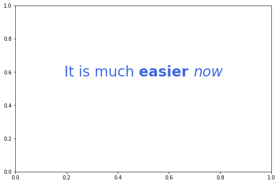
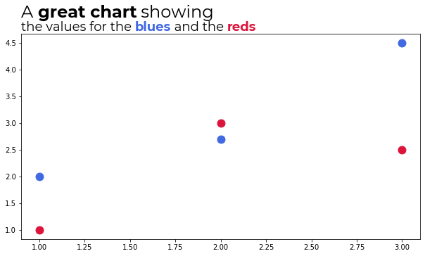

[](https://pypi.org/project/flexitext/)
[](https://github.com/tomicapretto/flexitext/actions/workflows/tests.yml)
[](https://github.com/ambv/black)
[](https://codecov.io/gh/tomicapretto/flexitext)


# Introduction

Flexitext is a Python library that makes it easier to draw text with multiple styles in Matplotlib. This library is inspired and influenced by the R package [`ggtext`](https://wilkelab.org/ggtext/).


## Installation

Flexitext requires a working Python interpreter (3.7+). This library can be installed using pip:

    pip install flexitext

Alternatively, you can install the development version from GitHub:

    pip install git+https://github.com/tomicapretto/flexitext.git


Flexitext only requires Matplotlib version 3.4 or higher.


## Overview

Albeit being inspired on [ggtext](https://wilkelab.org/ggtext/), Flexitext does not use HTML, CSS, or Markdown to specify text styles. On the contrary, it implements a tag-based styling that looks similar to HTML tags, but is not exactly like HTML. These formatted strings consist of three components:

* An opening tag that defines the styles to apply.
* The text to be styled.
* A closing tag, indicating the extent to which the styles in the opening tag apply.

Let's see an example:

```python
"<color:blue, size:16>This is blue text</> and this is regular text"
```

* <code>&lt;color:blue, size:16></code> is the opening tag. Styles are key-value pairs separated by `:`. Multiple styles are separated by commas.
* `This is blue text` is the text block. This text is going to be drawn using a font size of 16 and blue color.
* <code>&lt;/></code> is the closing tag. Only the text within the opening and the closing tags is formatted.

And finally we have ` and this is regular text`. This is going to be drawn using the default style because it is not contained within any formatting tags.


## Examples

The easiest way to use `flexitext` is through the `flexitext` function.


```python
import matplotlib as mpl
import matplotlib.pyplot as plt

from flexitext import flexitext

mpl.rcParams['figure.facecolor'] = 'w'
```


```python
fig, ax = plt.subplots(figsize=(9, 6))

text = "Normal text"
ax.text(0.5, 0.7, text, size=24, ha="center")

text = "<weight:bold, size:24>Bold text</>"
flexitext(0.5, 0.6, text, ha="center")

text = "<style:italic, size:24>Italic text</>"
flexitext(0.5, 0.5, text, ha="center")

text = "<weight:bold, size:24>Bold and</> <style:italic, size:24>italic too!</>"
flexitext(0.5, 0.4, text, ha="center");
```


    

    


Styles can be nested


```python
fig, ax = plt.subplots(figsize=(9, 6))

text = "<size:28, color:royalblue>It is much <weight:bold>easier </><style:italic>now</></>"
flexitext(0.5, 0.6, text, ha="center");
```


    

    


A more convoluted example:


```python
text = (
    "<size:28, color:blueviolet, name:Montserrat>You can write using\n</>"
    "<color:grey, size:24>multiple formats,\nand linebreaks\n\n"
    "<color:royalblue, name:Montserrat>also <weight:bold>bold text\n\n</></>"
    "<name:Montserrat>and why not <color:royalblue, style:italic>italics</> too</></>"
)

fig, ax = plt.subplots(figsize=(9, 6))
flexitext(0.5, 0.5, text, ha="center", ma="center");
```


    

    


Use the figure fraction coordinates to write a formatted title.


```python
fig, ax = plt.subplots(figsize=(9, 6))
fig.subplots_adjust(top=0.8, left=0.025)

x = [1, 2, 3]
y_blue = [2, 2.7, 4.5]
y_red = [1, 3, 2.5]


ax.scatter(x, y_blue, color="royalblue", s=120)
ax.scatter(x, y_red, color="crimson", s=120)

# Add flexitext
text = (
    "<name:Montserrat><size:24>A <weight:bold>great chart</> showing</>\n"
    "<size:18>the values for the "
    "<color:royalblue, weight:bold>blues</> and the <color:crimson, weight:bold>reds</></></>"
)
flexitext(0.025, 0.8, text, va="bottom", xycoords="figure fraction");
```


    

    


## Notes

Flexitext only supports the following styles

* alpha
* backgroundcolor
* color
* family
* name
* size
* style
* weight

See [Matplotlib's documentation](https://matplotlib.org/stable/api/_as_gen/matplotlib.axes.Axes.text.html#matplotlib.axes.Axes.text) for more information about their meaning and available values.

Flexitext logo is created with Flexitext and Matplotlib (see [here](https://github.com/tomicapretto/flexitext/tree/main/docsite/logo.ipynb)).

## Related work

* [highlight_text](https://github.com/znstrider/highlight_text): Flexitext and highlight_text have similar goals. This library, highlight_text, allows you to customize more aspects of the highlighted text, such as the bounding box of the text or the border of the text with path effects. On the other hand, it requires you to pass a styles as a separated list of dictionaries instead of within the text. 
